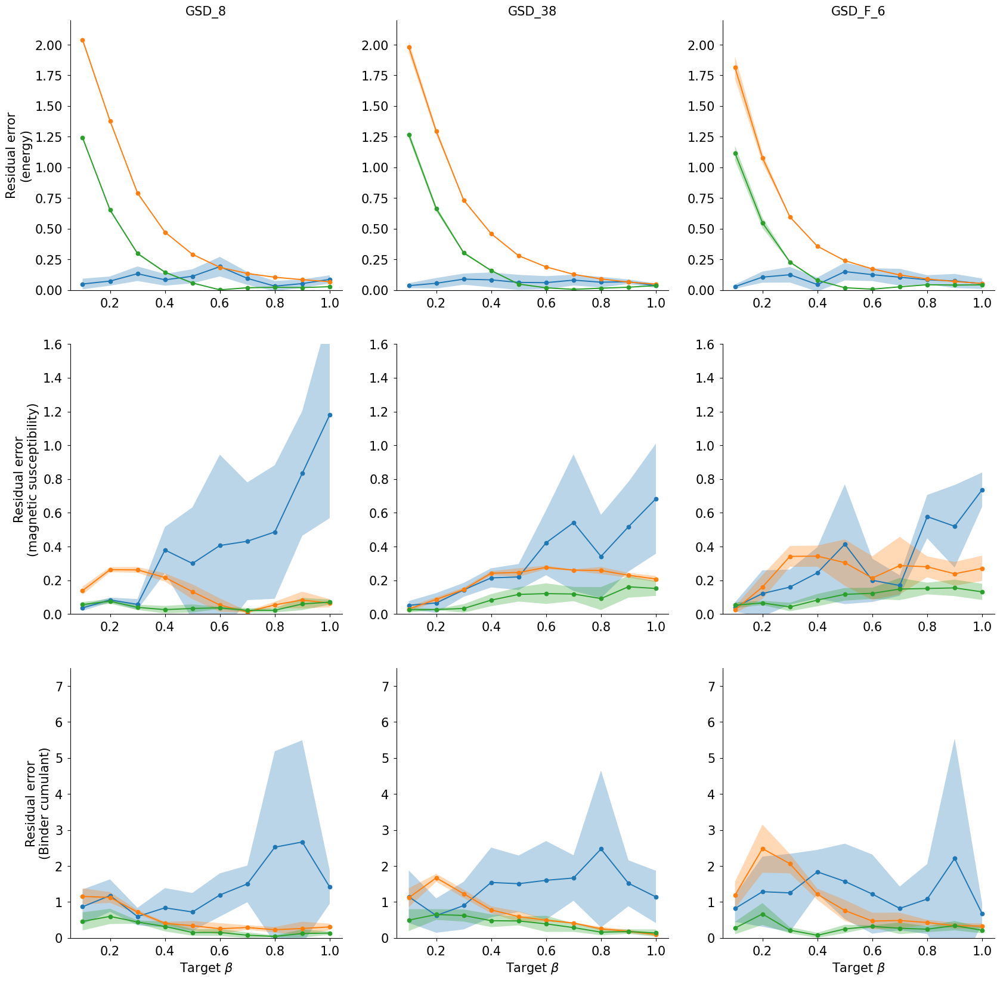

# fast-stein-correction
Implementation of "Boltzmann sampling with quantum annealers via fast Stein correction"

# Environment setup

```
$ python --version
Python 3.11.0
$ python -m venv .venv
$ source activate .venv/bin
$ pip install -r requirements.txt
```

# Usage

We show how to apply fast stein correction to your problems.
Whole code is in [`sample.py`](./sample.py).

1. Define your Hamiltonian on binary domain.
   ```python
   from stein.energy import create_hamiltonian
   dim = 6
   J = {
       (0, 1): -1.0,
       (0, 2): -1.0,
       (0, 3): 1.0,
       (0, 4): -1.0,
       (0, 5): 1.0,
       (1, 2): 1.0,
       (1, 3): -1.0,
       (1, 4): 1.0,
       (1, 5): 1.0,
       (2, 3): -1.0,
       (2, 4): -1.0,
       (2, 5): 1.0,
       (3, 4): 1.0,
       (3, 5): 1.0,
       (4, 5): -1.0,
   }

   h = {
       0: -1.0,
       1: -1.0,
       2: 1.0,
       3: -1.0,
       4: 1.0,
       5: -1.0,
   }

   def H(x):
       assert len(x) == dim
       t = 0
       for i in range(len(x)):
           t += h[i] * x[i]
           for j in range(i+1, len(x)):
               t += J[(i, j)] * x[i] * x[j]
       return t

   H = create_hamiltonian(J, h)
   ```

2. Input your samples and target inverse temperature $\beta$
   ```python
   from stein.ksd import boltzmann_correction
   from stein.util import IsingSampler

   from dimod.vartypes import Vartype

   import numpy as np

   X = IsingSampler.random([-1, 1], 6, 50)
   X = np.array(list(set([tuple(x) for x in X])))
   beta = 1.5
   weights = boltzmann_correction(
       dim=dim,
       samples=X,
       beta=beta,
       hamiltonian=H,
       vartype=Vartype.SPIN
   )
   ```

3. Compute physical quantity of your interest.
   ```python
   from stein.stats import GibbsDistribution

   trg = GibbsDistribution(H, beta, dim, True, Vartype.SPIN)
   energy = 0
   for x in trg.pmf_dict.keys():
       energy += trg.pmf(x) * H(x)
   print(energy) # -> -8.970194350573502
   ```

   Exact value is approximated by the weights.

   ```python
   energy = 0
   for w, x in zip(weights, X):
       energy += w * H(x)
   print(energy)
   ```

# Reproducing our experimental results

We provide the source code for the experiments and shell scripts to generate the figure in the ```notebooks/``` directory.

## Preparation

Run scripts to pre-compute exact values for each problem.

```
$ cd notebook
$ sh prepare.sh
```

## Running experiments and plot

```
$ sh run_experiments.sh
$ sh mcmc.sh
$ sh plot.sh
```



